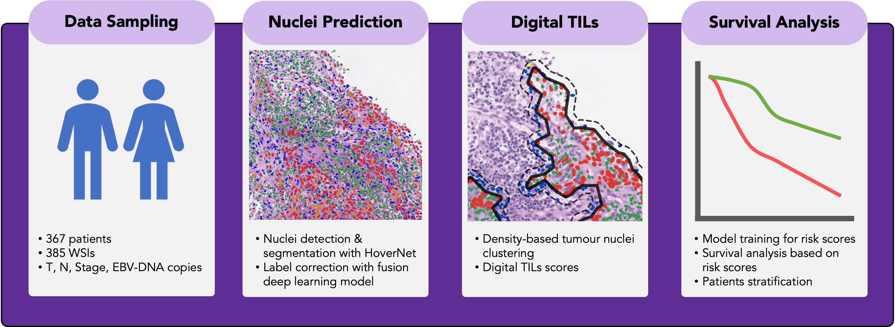

AI-Based Risk Score from Tumour-Infiltrating Lymphocyte Predicts Locoregional-Free Survival in Nasopharyngeal Carcinoma. *MDPI Cancers*

[Journal Link](https://www.mdpi.com/2072-6694/15/24/5789)

*TL;DR*: The code is designed to identify intratumoral and stromal tumor-infiltrating lymphocytes (TILs) through density-based clustering, ultimately generating 12 TILs scores as described in the paper.

## Pre-requisites:
* Linux (tested on Ubuntu 22.04)
* Python = 3.8, alphashape (1.3.1), opencv-python(4.6.0), Pillow (9.3.0), scikit-learn (1.2.0), scipy (1.9.3), shapely (2.0.0)

## Installation

```
git clone https://github.com/mdsatria/npc_digital_tils.git
cd npc_digital_tils # or your clone directory
conda create --name YOUR_ENV_NAME python=3.8
conda activate YOUR_ENV_NAME
pip install -r requirements.txt
```

## How to use
1. Detect nuclei in your images/WSIs with [HoverNet](https://github.com/vqdang/hover_net)
2. Open terminal in cloned git directory 
3. `chmod +x run_clustering.sh` 
4. Change the argument based on your setting
5. `./run_clustering.sh`
6. See examples.ipynb to visualise TILs and how to generate TILs scores

## Usage and options
```
--input_dir         Directory to nuclei annotation from HoverNet
--output_dir        Directory to save the results
--use_concave       Create concave cluster or not. If false, cluster is convex (may faster)
--nuclei_dist       Minimum distance between nuclei, clustering hyperparameter.
--num_nuclei        Minimum number of nuclei in cluster, clustering hyperparameter.
--outer_buffer      Size of the enlarged cluster area
--num_worker        CPU count for multiprocessing
```

## License
If you find our work useful in your research, please consider citing our paper at:
```
@article{wibawa_ai-based_2023,
	title = {AI-Based Risk Score from Tumour-Infiltrating Lymphocyte Predicts Locoregional-Free Survival in Nasopharyngeal Carcinoma},
	author = {Wibawa, Made Satria and Zhou, Jia-Yu and Wang, Ruoyu and Huang, Ying-Ying and Zhan, Zejiang and Chen, Xi and Lv, Xing and Young, Lawrence S and Rajpoot, Nasir},
	journal={Cancers},
	year = {2023},
	publisher={MDPI}
}
```